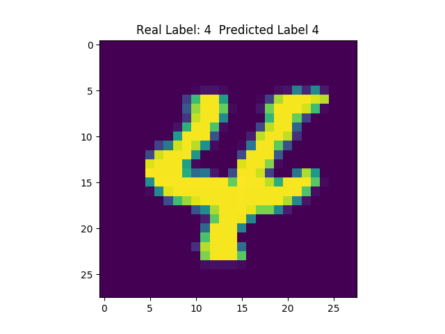

```shell
python run.py
```
```shell
  --batch BATCH  Training Batch size default: 100
  --iters ITERS  Number of training iterations default: 3000
  --lr LR        Model learning rate default: 0.001
  --load LOAD    True: Load trained model False: Train model default: True

```


<div>  </div>
<div>  </div>
<div>  </div>
<div>  </div>
<div>  </div>


